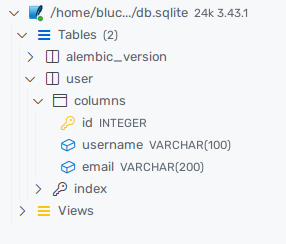
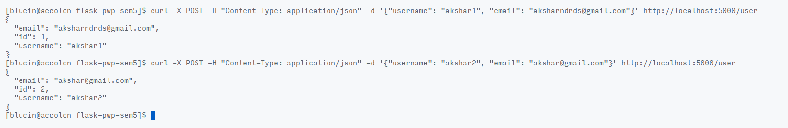
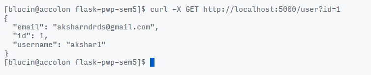
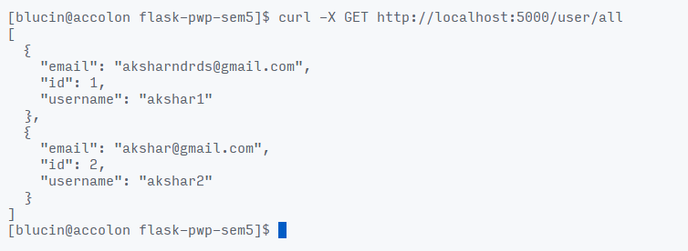
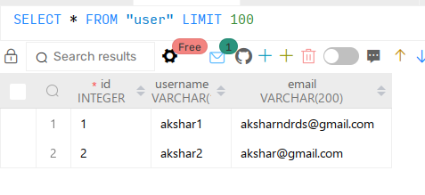

# Python and Web Programming Flask Practical

<!-- metadata (use pandoc) 
% title: Python and Web Programming Practical 9
% author: Akshar Patel (12102110501003) CSE-IoT Batch A
% date: September 28, 2023
-->

## Installation 
1. Create a virtual environment (WARNING: This step depends on your shell)
```bash
python -m venv .venv
# Only run one of the following commands
.venv/bin/activate.ps1              # For PowerShell
.venv/bin/activate                  # For Bash
.venv/Scripts/activate.bat          # For CMD
source .venv/Scripts/activate.fish  # For Fish
```

2. Install from requirements.txt
```bash
pip install -r requirements.txt
```

## Practical 10 - Flask Tutorial

<!-- 
Practical 10 Flask: Create REST API using Python Flask to send the form data like username, email into the database
and test that API.
-->

### 1. Create a Flask App

- Create a file `app.py` and add the following code to it:

```python
from flask import Flask, request, jsonify
from flask_sqlalchemy import SQLAlchemy
from flask_marshmallow import Marshmallow
from flask_migrate import Migrate
import os

# Init app
app = Flask(__name__)
basedir = os.path.abspath(os.path.dirname(__file__))

# Database
app.config['SQLALCHEMY_DATABASE_URI'] = 'sqlite:///' + os.path.join(basedir, 'db.sqlite')

db = SQLAlchemy(app) # Init db
ma = Marshmallow(app) # Init ma
migration = Migrate(app, db) # Init migration

# User Class/Model
class User(db.Model):
    id = db.Column(db.Integer, primary_key=True)
    username = db.Column(db.String(100), unique=True)
    email = db.Column(db.String(200), unique=True)

    def __init__(self, username, email):
        self.username = username
        self.email = email

# User Schema (for marshmallow)
class UserSchema(ma.Schema):
    class Meta:
        fields = ('id', 'username', 'email')

# Init Schema
user_schema = UserSchema()
users_schema = UserSchema(many=True)

# Post handler
@app.route('/user', methods=['POST'])
def add_user():
    username = request.json['username']
    email = request.json['email']

    new_user = User(username, email)

    db.session.add(new_user)
    db.session.commit()

    return user_schema.jsonify(new_user)

# Get handler
@app.route('/user', methods=['GET'])
def get_users():
    id = request.args.get('id')
    if id:
        user = User.query.get(id)
        return user_schema.jsonify(user)
    else:
        return jsonify({'message': 'No user found'})

@app.route('/user/all', methods=['GET'])
def get_all_users():
    all_users = User.query.all()
    if all_users:
        result = users_schema.dump(all_users)
        return jsonify(result)
    else:
        return jsonify({'message': 'No users found'})

# Run server
if __name__ == '__main__':
    app.run(debug=True)
```

### 2. Run migrations

- Run the following commands to create the database and run migrations:

```bash
flask db init
flask db migrate
flask db upgrade
```

- You should see the following table in the database:



### 3. Test the API

- Run the server using `python app.py`

- Test the api by the following curl commands:

#### POST Request to add a user

```bash
curl -X POST -H "Content-Type: application/json" -d '{"username": "akshar1", "email": "aksharndrds@gmail.com"}' http://localhost:5000/user

curl -X POST -H "Content-Type: application/json" -d '{"username": "akshar2", "email": "akshar@gmail.com"}' http://localhost:5000/user
```



### GET Request to get a user
```bash
curl -X GET http://localhost:5000/user?id=1
```



### GET Request to get all users
```bash
curl -X GET http://localhost:5000/user/all
```



### Database after adding users

